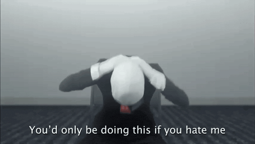

# slenderman-decompile
Attempt at a 1-to-1 "decompilation" of *Slender: The Eight Pages* v0.9.7. (*decompilation* isn't really accurate for what this is, but it's generally the best term.)

# Requirements
- [Unity 3.5.5f3](https://beta.unity3d.com/download/UnitySetup-3.5.5.exe)

# Info
- Project intended for use with the (upcoming) PlayStation 3 port of the game.
- This game's codebase is genuinely horrible, do not expect to learn anything from this.
  - Majority of the scripts are slightly-modified, if not stock Unity packages.
- While we personally don't have any plans to, you're more than free to fork this project and make a port to a more modern version.
- Project is extremely unorganized, as Charlotte was extremely lazy.
- "Decomp" was made in less than a day. (Good job!)

# Licensing
[License can be found here.](./LICENSE)

[</img>](https://www.youtube.com/watch?v=AwSFSoekGQU)